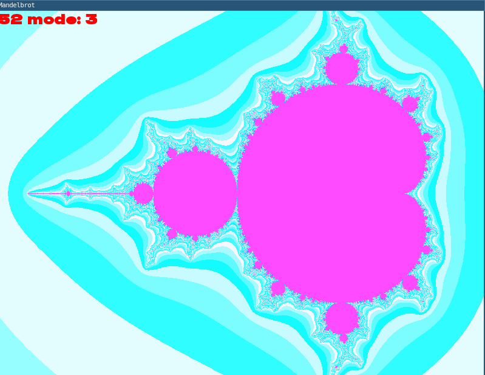

# Генерация множества Мандельброта на CPU и векторные оптимизации 

## Введение

Эта программа генерирует и визуализирует на экране [множество Мандельброта](https://ru.wikipedia.org/wiki/%D0%9C%D0%BD%D0%BE%D0%B6%D0%B5%D1%81%D1%82%D0%B2%D0%BE_%D0%9C%D0%B0%D0%BD%D0%B4%D0%B5%D0%BB%D1%8C%D0%B1%D1%80%D0%BE%D1%82%D0%B0). Алгоритм выполняется на центральном процессоре с применением [SIMD](https://ru.wikipedia.org/wiki/SIMD) инструкций.
Также в работе проводится сравнение эффективности 3 различных реализаций алгоритма рендеринга.

## Особенности системы

Этот код написан под операционную систему Linux. Процессор Intel I5-7300HQ
Это процессор поддерживает SIMD инструкции стандарта AVX2 и ниже. Это означает, что процессор может выполнять векторные инструкции над 256 битами данных одновременно. 

## Скачивание и установка

### Зависимости

В этой программе для визуализации множества Мандельброта используется графическая библиотека [sfml](https://www.sfml-dev.org/), а для сборки используется система сборки ['make'](https://ru.wikipedia.org/wiki/Make)

### Скачивание

В первую очередь нужно выполнить клонирование репозитория на свой компьютер выполнив следующую команду:

``` bash
git clone https://github.com/dmitry131131/SIMD_project.git
```

### Сборка

Программу можно собрать в двух разных версиях
1. Графическая реализация 
2. Графическая реализация + тест производительности

Для сборки **первой** версии выполните команду: 
```bash
make
```
Для сборки **второй** версии выполните команду:
```bash
make test
```

## Использование

Окно приложения представляет собой графическое окно размером *800x600*px, в котором рисуется изображение фрактала Мандельброта. В левом верхнем углу отображается значение текущего FPS.



Взаимодействие с программой производится посредством клавиатуры.

Клавиша|Действие
:-----:|:-------
 ↑     | Сдвиг области видимости вверх
 ↓     | Сдвиг области видимости вниз
 ←     | Сдвиг области видимости влево
 →     | Сдвиг области видимости вправо
\+     | Увеличение изображения
\-     | Уменьшение изображения
1      | Выбор режима попиксельного рендеринга
2      | Выбор режима рендеринга массивом по 8 пикселей
3      | Выбор режима SIMD рендеринга

### Тестовый режим
В тестовом режиме помимо графического окна в консоль печатается количество тактов процессора необходимое для рендеринга 20 изображений фрактала каждым из способов, а на экране пишется сообщение о тестировании.
Ниже будут приведены усреднённые результаты многократных измерений в тестовом режиме

## Режимы рендеринга

1) **Попиксельный рендеринг** В этом режиме рендеринг происходит посредством отдельной обработки каждого пикселя в двойном цикле
2) **Оптимизация на массивах** В этом режиме программа за 1 итерацию цикла обрабатывает массив из 8 пикселей, что позволяет компилятору в режиме `-O3` выполнить частичную векторизацию этого процесса.
3) **Оптимизация на SIMD инструкциях** В этом режиме используются AVX2 методы, что позволяет добиться большей оптимизации, чем при неявном использовании AVX2 инструкций компилятором.

## Результаты тестов

В этой таблице представлены средние значения времени выполнения разных методов рендеринга в тиках процессора:

> [!NOTE]
> Измерение времени рендеринга производится функцией `__rdtsc()`, которая считает количество процессорных тактов. Такой способ является наиболее точным, потому что минимизируются накладные расходы на вызов функций(`__rdtsc()` раскрывается в отдельную ассемблерную инструкцию).

Метод рендеринга | Попиксельный | Массивы    | SIMD 
-----------------|--------------|------------|-
Тики             | 6269939484   | 2626102068 | 924851686

Из этих результатов можно сделать вывод, что оптимизация с массивами работает в `2.4` раза быстрее, чем простейшая реализация. А SIMD оптимизация быстрее в `6.8` раз. 

## Особенности реализации

Приведём пример простейшей реализации только для того, чтобы объяснить суть дальнейших оптимизаций.

```c
    for (size_t line = 0; line < WINDOW_HEIGHT; line++) // Цикл обхода рендеринга по строчкам
    {
        // Вычисление положения самого левого пикселя в строчке
        float x_0 = (-((float) WINDOW_WIDTH / 2) * dx + X_offset) * scale;          
        float y_0 = (((float) line - ((float) WINDOW_HEIGHT / 2)) * dy) * scale;
        
        // Цикл обработки каждого пикселя в строчке
        for (size_t col = 0; col < WINDOW_WIDTH; col++, x_0 += dx*scale)            
        {
            float x_n = x_0; // Инициализация начальных координат для текущего пикселя
            float y_n = y_0;
            size_t count = 0;

            while (count <= MAX_ITERATIONS) // Цикл обработки текущего пикселя
            {
                count++;
                float X2 = x_n*x_n;   // x^2
                float Y2 = y_n*y_n;   // y^2
                float XY = x_n*y_n;   // x*y

                float len = X2 + Y2;  // Вычисление расстояния от центра

                if (len >= RADIUS2) break; // Сравнение с максимально допустимым расстоянием

                x_n = X2 - Y2 + x_0;  // Вычисление координат для следующей итерации цикла
                y_n = XY + XY + y_0;
            }
            // Вычисление цвета в зависимости от числа прохода цикла
            array[line*WINDOW_WIDTH + col] = (sf::Uint32) (0xffffffff - color_constant * (count - 1));   
        } 
    }
```

Как можно заметить в этой реализации большую часть времени занимают однотипные операции вычисления, что мы попытаемся оптимизировать в следующей реализации:

### Оптимизация на массивах

```c

float real_dx = dx*scale; // Вычисление смещения по горизонтали с учётом текущего zoom-коэффициента 

for (size_t line = 0; line < WINDOW_HEIGHT; line++) // Цикл обхода рендеринга по строчкам
    {
        // Вычисление положения самого левого пикселя в строчке
        float x_0 = (-((float) WINDOW_WIDTH / 2) * dx + X_offset) * scale;                  
        float y_0 = (((float) line - ((float) WINDOW_HEIGHT / 2)) * dy) * scale;
        
        // Цикл обработки строчки по 8 пикселей за раз
        for (size_t col = 0; col < WINDOW_WIDTH; col += 8, x_0 += 8*real_dx)                
        {
            // Инициализация массива начальных положений пикселей
            float X0[8] = {x_0, x_0 + real_dx, x_0 + 2*real_dx, x_0 + 3*real_dx, x_0 + 4*real_dx, x_0 + 5*real_dx, x_0 + 6*real_dx, x_0 + 7*real_dx};

            // Инициализация начальных значений для текущих пикселей
            float X_N[8] = {}; for (size_t i = 0; i < 8; i++) X_N[i] = X0[i];               
            float Y_N[8] = {}; for (size_t i = 0; i < 8; i++) Y_N[i] = y_0;
            int count = 0;
            int real_count[8] = {};

            while (count < MAX_ITERATIONS) // Цикл обработки 8 текущих пикселей
            {
                count++;
                float X2[8] = {}; for (size_t i = 0; i < 8; i++) X2[i] = X_N[i] * X_N[i];// x^2
                float Y2[8] = {}; for (size_t i = 0; i < 8; i++) Y2[i] = Y_N[i] * Y_N[i];// y^2
                float XY[8] = {}; for (size_t i = 0; i < 8; i++) XY[i] = X_N[i] * Y_N[i];// x*y

                // Вычисление расстояния пикселя от начала координат
                float R2[8] = {}; for (size_t i = 0; i < 8; i++) R2[i] = X2[i] + Y2[i];     

                int cmp[8] = {}; // Сравнение с максимально допустимым расстоянием
                for (size_t i = 0; i < 8; i++) if (R2[i] <= RADIUS2) cmp[i] = 1;            

                int mask = 0;  // Проверка на досрочное завершение цикла
                for (size_t i = 0; i < 8; i++) mask |= (cmp[i] << i); 
                if (!mask) break;

                // Вычисление количества проходов для каждого пикселя(для определения цвета)
                for (size_t i = 0; i < 8; i++) real_count[i] += cmp[i];                     

                // Вычисление координат для следующей итерации
                for (size_t i = 0; i < 8; i++) X_N[i] = X2[i] - Y2[i] + X0[i];              
                for (size_t i = 0; i < 8; i++) Y_N[i] = XY[i] + XY[i] + y_0;
            }
            // Вычисление цвета каждого пикселя
            for (size_t i = 0; i < 8; i++) array[line*WINDOW_WIDTH + col + i] = (sf::Uint32) (0xffffffff - color_constant * real_count[i]); 
        } 
    }

```

Можно заметить, что все операции из первого примера были заменены на циклы с массивом размером в 8 элементов. Размер массивов выбран не случайно, выполняя однотипные операции в циклах над массивами по 8 элементов мы провоцируем компилятор самостоятельно применить SIMD оптимизации для повышения производительности.

### SIMD оптимизации

```c
    float real_dx = dx*scale;  // Вычисление смещения по горизонтали с учётом текущего zoom-коэффициента
    __m256 MaxRadius = _mm256_set1_ps(RADIUS2);  // заполнение вектора значениями максимально расстояния от начала координат

    for (size_t line = 0; line < WINDOW_HEIGHT; line++) // Цикл обхода рендеринга по строчкам
    {
        // Вычисление положения самого левого пикселя в строчке
        float x_0 = (-((float) WINDOW_WIDTH / 2) * dx + X_offset) * scale;                      
        float y_0 = (((float) line - ((float) WINDOW_HEIGHT / 2)) * dy + Y_offset) * scale;
        
        // Цикл обработки строчки по 8 пикселей за раз
        for (size_t col = 0; col < WINDOW_WIDTH; col += 8, x_0 += 8*real_dx)                    
        {
            __m256 DX = _mm256_set1_ps(real_dx); // Инициализация начальных значений для текущих пикселей
            __m256 Mul_array = _mm256_set_ps(7, 6, 5, 4, 3, 2, 1, 0);
            DX = _mm256_mul_ps(DX, Mul_array);
            __m256 X0 = _mm256_set1_ps(x_0);
            X0 = _mm256_add_ps(X0, DX);

            __m256 Y0 = _mm256_set1_ps(y_0);

            __m256 X_N = X0;  // Инициализация начальных значений для текущих пикселей
            __m256 Y_N = Y0;

            int count = 0;
            __m256i real_count = _mm256_setzero_si256();
            while (count < MAX_ITERATIONS) // Цикл обработки 8 текущих пикселей
            {
                count++;
                __m256 X2 = _mm256_mul_ps(X_N, X_N);  // x^2
                __m256 Y2 = _mm256_mul_ps(Y_N, Y_N);  // y^2
                __m256 XY = _mm256_mul_ps(X_N, Y_N);  // x*y

                // Вычисление расстояния пикселя от начала координат
                __m256 R2 = _mm256_add_ps(X2, Y2);                                              

                // Сравнение с максимально допустимым расстоянием
                __m256 res = _mm256_cmp_ps(R2, MaxRadius, _CMP_LE_OS);                          

                // Проверка на досрочное завершение цикла
                if (!_mm256_movemask_ps(res)) break;                                            

                // Вычисление количества проходов для каждого пикселя(для определения цвета)
                __m256i temp = _mm256_castps_si256(res);                                        
                temp = _mm256_srli_epi32(temp, 31);
                real_count = _mm256_add_epi32(real_count, temp0);

                // Вычисление координат для следующей итерации
                X_N = _mm256_sub_ps(X2, Y2);                                                    
                X_N = _mm256_add_ps(X_N, X0);

                Y_N = _mm256_add_ps(XY, XY);
                Y_N = _mm256_add_ps(Y_N, Y0);
            }
            // Определение цвета пикселей
            __m256i out_array  = _mm256_set1_epi32(0xffffffff);                                 
            __m256i temp_color = _mm256_set1_epi32(color_constant);
            temp_color         = _mm256_mullo_epi32(temp_color, real_count);
            out_array          = _mm256_sub_epi32(out_array, temp_color);

            // Копирование пикселей в итоговый буфер
            memcpy(array + line*WINDOW_WIDTH + col, &out_array, 32);
        } 
    }
```

В этой реализации все циклы с массивами были заменены на SIMD инструкции. Последовательность команд немного усложнилась, но при этом общая производительность сильно возросла. Стоит отметить, что также удалось векторизовать и вычисление цвета пикселей, что дало дополнительную прибавку к производительности приблизительно в 7%.

> [!NOTE]
> Раз SIMD реализация настолько эффективная, зачем нужна оптимизация на массивах?
> Дело в том, что SIMD инструкции не являются кроссплатформенными и работают только на одной архитектуре и на одном поколении процессоров.
> А реализация на массивах является кроссплатформенной, потому что компилятор выбирает оптимизирующие инструкции, которое поддерживаются данным процессором.
